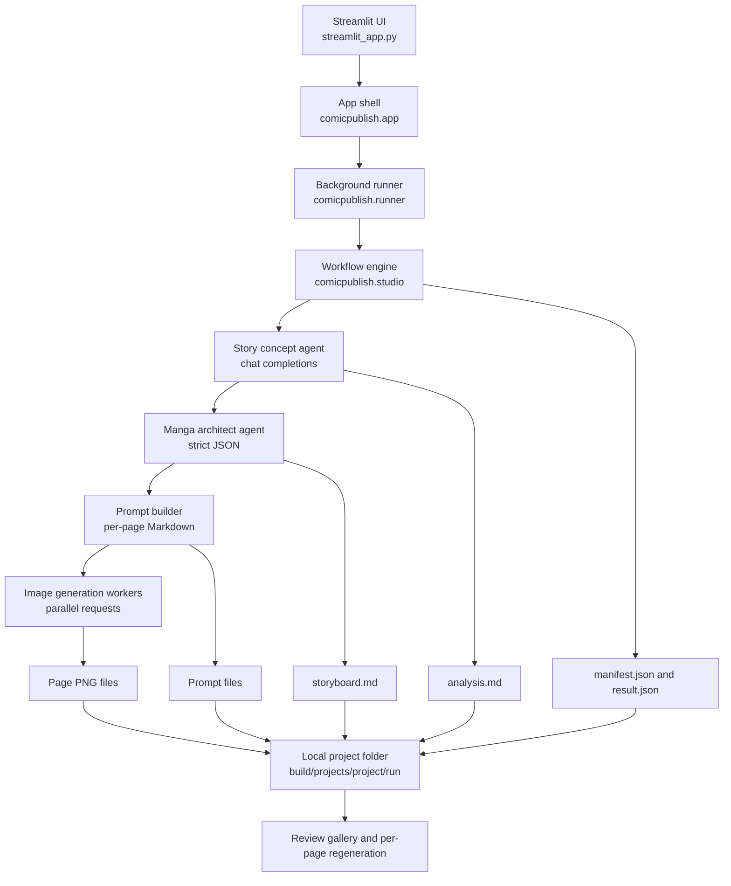

# Comic Tools

Comic Tools is a local production desk for turning long-form source text into short educational comic pages. The main application is **AtSolution Comic Studio**, a Streamlit UI that runs a structured planning and image-generation workflow, saves every intermediate artifact, and lets an operator review or regenerate pages.

Published examples can be viewed on my Xiaohongshu profile:

https://www.xiaohongshu.com/user/profile/602374270000000001007bca

## What It Does

- Accepts source text, optional title override, output language, page count, comic style, and tone notes.
- Uses a planning model to turn the source into a teachable comic concept.
- Uses a second planning pass to produce structured page-by-page storyboard JSON.
- Converts each storyboard page into a detailed image prompt.
- Stops at a planning checkpoint after writing per-page JSON and Markdown prompts.
- Generates or regenerates portrait comic page images through an OpenAI-compatible image endpoint on demand.
- Saves the input, analysis, storyboard, page prompts, page JSON, image files, manifest, and result JSON under a local run folder.
- Runs generation in a background thread so the Streamlit UI can keep showing status, logs, progress, metrics, and generated pages.
- Supports per-page image regeneration from the saved prompt without rerunning the whole planning workflow.

## Method

The workflow is intentionally staged so the output is inspectable and reproducible.

1. **Operator input**
   The Streamlit app collects the source text and production settings.

2. **Concept planning**
   `run_story_concept_agent()` asks a chat-completions-compatible model to create a comic learning concept from the source text.

3. **Storyboard architecture**
   `run_manga_architect_agent()` asks the planning model to return strict JSON with a `series_name`, `total_pages`, and `pages_list`.

4. **Prompt writing**
   Each page is converted into a saved Markdown prompt file. The prompt includes page number, total pages, script content, audience, language, style, title instructions for page one, and portrait image-size requirements.

5. **Operator image checkpoint**
   The Streamlit gallery lists every planned page before image calls start. The operator can generate all missing images in parallel, generate one page, or retry failed pages from saved JSON and prompt files.

6. **Parallel image generation**
   `ThreadPoolExecutor` dispatches requested page image calls concurrently. `IMAGE_PARALLELISM` is capped between 1 and 3.

7. **Local artifact persistence**
   Every run writes files to:

   ```text
   build/projects/<project-slug>/<run-id>/
   ```

8. **Review and regeneration**
   The UI reads the saved manifest and page JSON files. Failed or unsatisfactory pages can be regenerated from their saved prompt.

## Architecture



## Code Layout

```text
src/comicpublish/
  app.py        Streamlit UI rendering, forms, gallery, status panels
  runner.py     Background job thread, status snapshots, page regeneration
  studio.py     Main planning, prompt, image generation, and persistence workflow
  config.py     .env loading, endpoint/model settings, validation
  pipeline.py   Shared slug helper

streamlit_app.py  Streamlit entrypoint
tests/            Unit tests for helpers, studio, and runner behavior
spec/             Product/spec notes
```

## Generated Run Structure

The real Studio workflow writes a complete run folder:

```text
build/projects/<project-slug>/<run-id>/
  input.json
  analysis.md
  storyboard.md
  manifest.json
  result.json
  pages/
    page-01.json
    page-02.json
    <series_name>_manga_1.png
    <series_name>_manga_2.png
  prompts/
    01-page-<series_name>.md
    02-page-<series_name>.md
```

`build/` is intentionally ignored by Git because it contains generated project outputs.

## Configuration

Copy `.env.example` to `.env` and fill in the real credentials.

```env
PLANNING_BASE_URL=https://jmrai.net
PLANNING_API_KEY=
PLANNING_MODEL=gemini-3.1-pro
PLANNING_MAX_TOKENS=12000

IMAGE_BASE_URL=https://jmrai.net
IMAGE_API_KEY=
IMAGE_MODEL=gpt-image-2
IMAGE_SIZE=1248x1664
IMAGE_PARALLELISM=3
IMAGE_RETRY_ATTEMPTS=2

COMICPUBLISH_OUTPUT_DIR=build
REQUEST_TIMEOUT_SECONDS=300
```

The planning endpoint must support OpenAI-style `/v1/chat/completions`. The image endpoint must support OpenAI-style `/v1/images/generations` with `response_format=b64_json`.

## Run The Studio

```bash
python -m pip install -e . --no-build-isolation
streamlit run streamlit_app.py
```

Do not run the Streamlit app with `python streamlit_app.py`; use `streamlit run streamlit_app.py`.

## Git Hygiene

The repository tracks source, tests, specs, README, and configuration examples. It does not track local secrets or generated comic projects:

- `.env`
- `build/`
- `build/projects/`
- `build/runs/`
- `build/runner/`
- Python caches and packaging output
